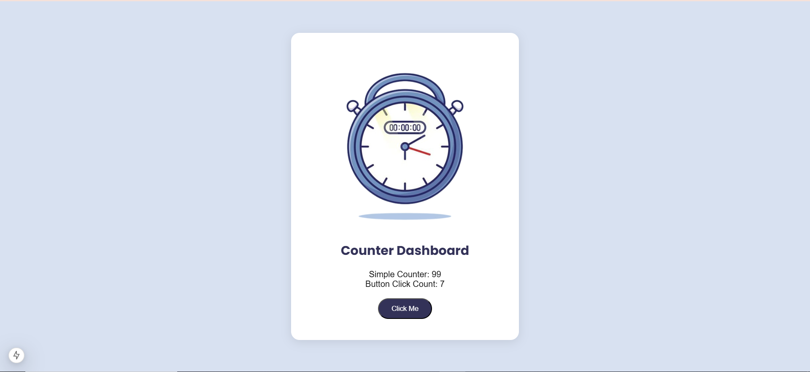

   
  <h1>🖥️ Counter Dashboard</h1>
  <strong>This is a simple counter application built with React and Mantine. It showcases a basic layout that automatically increments a counter on page load and tracks the number of button clicks. The project demonstrates the usage of React hooks and Mantine components.</strong> &nbsp; 

 
 

## 🌟 Features:
* <strong> Auto-Increment Counter: </strong>Automatically increments every second.
* <strong>Button Click Counter: </strong>Tracks how many times the button has been clicked.
* <strong>Stylish UI: </strong>Uses Mantine components for a clean, responsive design.
* <strong>CSS Modules: </strong>Organized styling with modular CSS (counter.module.css).
 
 

## 📋 How to Use
1. Clone the repository and install dependencies.
2. Run the application with your preferred development server.
The page will show:
* A counter that increments every second.
* A button labeled "Click Me" that increments a separate counter with each click.
 
 

## 📷:

  

 
